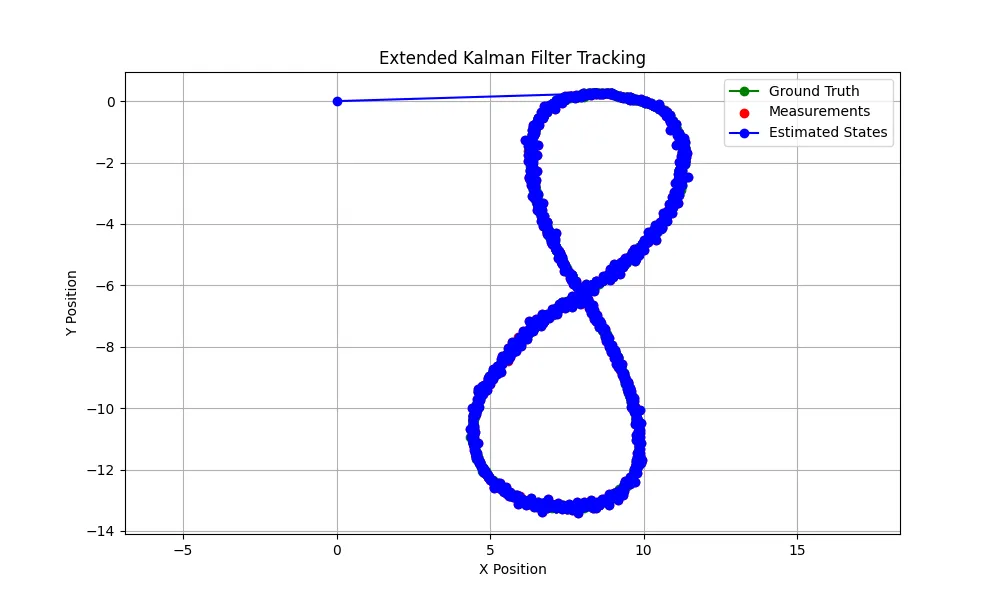

# Extended Kalman Filter (EKF) for State Estimation

## Overview

This project implements an Extended Kalman Filter (EKF) for state estimation of a moving object using Lidar and Radar measurements. The EKF is designed to estimate the position and velocity of an object in a 2D space, allowing for the processing of non-linear measurements through a series of predictions and updates.

## Features

- **State Vector**: Estimates the position and velocity of an object in 2D space.
- **Lidar Measurement Updates**: Incorporates Lidar measurements for state refinement.
- **Radar Measurement Updates**: Handles non-linear Radar measurements and updates the state accordingly.
- **Dynamic Noise Handling**: Configurable process and measurement noise covariances for improved accuracy.
- **Data Visualization**: Plots ground truth, measurements, and estimated states for easy comparison.

## Installation

1. Clone the repository:
    ```bash
    git clone https://github.com/yourusername/ekf_state_estimation.git
    ```

2. Navigate to the project directory:
    ```bash
    cd ekf_state_estimation
    ```

3. Ensure you have the required packages installed. You can install them via pip:
    ```bash
    pip install numpy matplotlib
    ```

## Usage

1. Your input data in a text file. The format should be as follows:
    - For Lidar measurements: `L <meas_px> <meas_py> <timestamp> <gt_px> <gt_py> <gt_vx> <gt_vy>`
    - For Radar measurements: `R <meas_rho> <meas_phi> <meas_rho_dot> <timestamp> <gt_px> <gt_py> <gt_vx> <gt_vy>`
    


2. Modify the `input_file` and `output_file` paths in the `__main__` section of the code:
    ```python
    input_file = "path_to_your_input_file.txt"
    output_file = "path_to_your_output_file.txt"
    ```

3. Run the script:
    ```bash
    python ekf.py
    ```

4. The results will be saved to the specified output file, and a plot will be displayed showing the ground truth, measurements, and estimated states.

## Code Explanation

- The `ExtendedKalmanFilter` class implements the EKF algorithm.
    - **`__init__`**: Initializes the state vector, covariance matrix, and noise covariances.
    - **`predict`**: Predicts the next state based on the current state and time interval.
    - **`update_lidar`**: Updates the state using Lidar measurements.
    - **`update_radar`**: Updates the state using Radar measurements and calculates the Jacobian for non-linear measurement updates.
    - **`normalize_angle`**: Ensures angles are within the range of -π to π.
    
- The `process_measurements` function handles input file reading, EKF processing, and result storage.
- The `plot_results` function visualizes the ground truth, measurements, and estimated states using Matplotlib.

## Example Output



## Contributions

Contributions to improve the EKF implementation are welcome! Feel free to open issues or submit pull requests.

